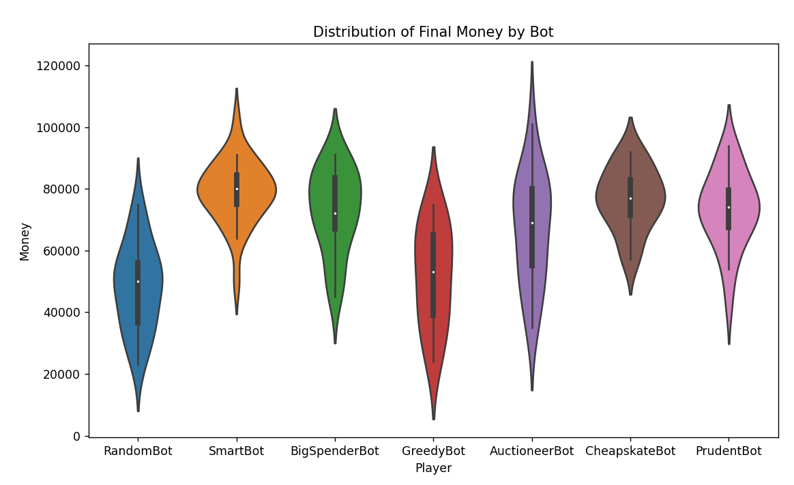

# For Sale Game Simulator

## Overview
This project is a simulation of the board game "For Sale". It includes several AI players with different strategies that can play against each other. The game consists of two phases: the buying phase, where players bid on properties, and the selling phase, where players sell their properties for the highest possible price.

## AI Players
### Implemented

#### RandomBot: 
  I randomly selects a bid in the buying phase and a property to sell in the selling phase. Chaos shall rule  
  
*What are the rules, what am i even doing here? i guess i bet this much?*

#### GreedyBot
I always tries to buy the cheapest available property and sell the least. And I stop at nothing to win.
valuable property.  

*What do you mean i have run out of money?!?*

#### CheapskateBot

I will min bid as long as the bid is 25% of remaining money or 2000, whichever is greater 

*I wanna play, but i dont want to spend money....*

#### PrudentBot

During the bidding phase, I assess the quality of the properties available. 

If high-quality properties (above a certain threshold) are available, I'm willing to bid up to 60% of its remaining money. For properties below this threshold, I only bid up to 40% of my remaining money.

- In the buying phase, I prefer to buy the property closest to the mean of the available properties I can afford.

- In the selling phase, I sell the property closest to the mean of my owned properties. 

*Money doesnt grow on trees you know, Dont go wasting it*

#### SmartBot

During the bidding phase, I bids up to 50% of its remaining money if I can afford the next highest bid.
In the buying phase, I buys the property closest to the median of the available properties I can afford.
In the selling phase, I sells the property closest to the median of my owned properties.

*Do not mistake silence for weakness, smart people do not plan bold moves out loud.*

#### AuctioneerBot

During the bidding phase, I takes into consideration the probability of getting a high-quality property (above a certain threshold) 
based on the remaining properties. If the probability is high, I bids up to 70% of its remaining money. If the probability is low, 
I only bids up to 30% of my remaining money.

*Going once, going twice, SOLD to that cluster of Ram over there*

## Getting Started

## Files in This Repository
RunGame.py: This is the main file to run the game.
forsale.py: This contains the Game class, which handles the game logic. TODO split out the players

## Built With
Python

## Contributing
Pull requests are welcome. For major changes, please open an issue first to discuss what you would like to change.

## License
This project is licensed under the MIT License - see the LICENSE.md file for details

## Acknowledgements
The creators of the "For Sale" board game for the game mechanics and rules
