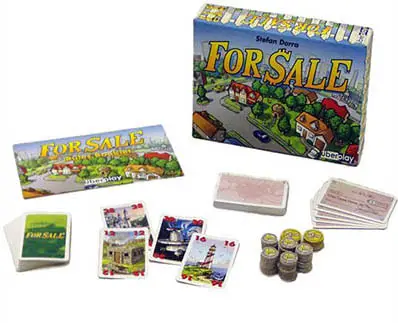
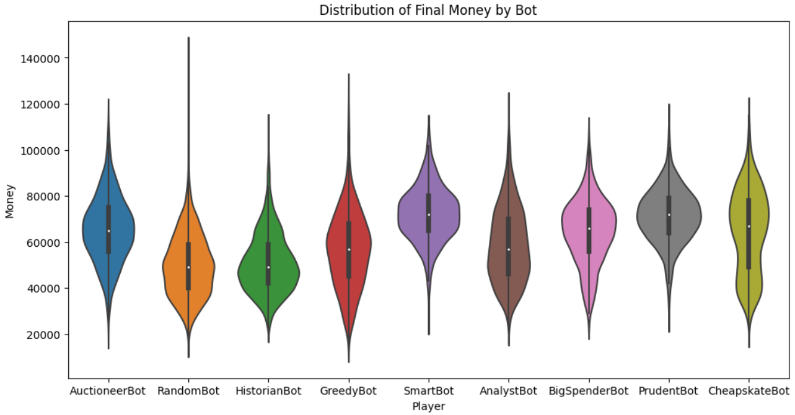
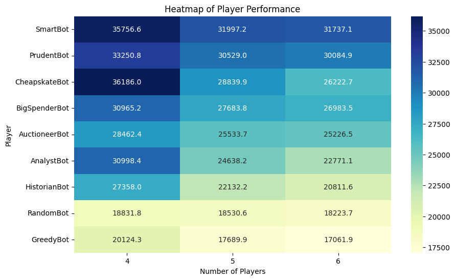
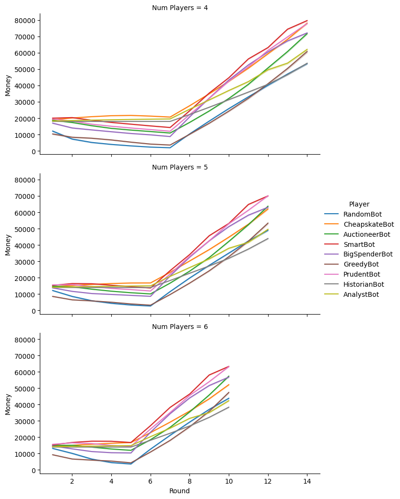
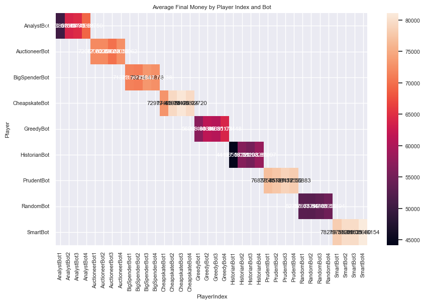
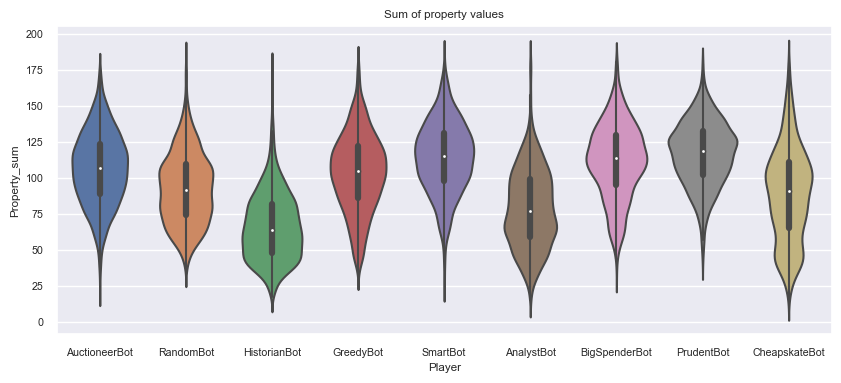

# For Sale Game Simulator

## Overview
This project is a simulation of the board game "For Sale". It includes several AI players with different strategies that can play against each other. The game consists of two phases: the buying phase, where players bid on properties, and the selling phase, where players sell their properties for the highest possible price.

## AI Players
### Implemented

#### RandomBot: 
  I randomly select a bid in the buying phase and a property to sell in the selling phase. Chaos shall rule  
  
*What are the rules, what am i even doing here? i guess i bet this much?*

#### GreedyBot
I always tries to buy the cheapest available property and sell the least. And I stop at nothing to win.
valuable property.  

*What do you mean i have run out of money?!?*

#### CheapskateBot

I will min bid as long as the bid is 25% of remaining money or 2000, whichever is greater 

*I wanna play, but i dont want to spend money....*

#### PrudentBot

During the bidding phase, I assess the quality of the properties available. 

If high-quality properties (above a certain threshold) are available, I'm willing to bid up to 60% of its remaining money. For properties below this threshold, I only bid up to 40% of my remaining money. 

*Patience is a virtue, and I'm extremely virtuous*

#### SmartBot

During the bidding phase, I bids up to 50% of its remaining money if I can afford the next highest bid.
In the buying phase, I buys the property closest to the median of the available properties I can afford.
In the selling phase, I sells the property closest to the median of my owned properties.  

*Intelligence is the ability to adapt to change... and I'm always changing my bids!*

#### AuctioneerBot

During the bidding phase, I takes into consideration the probability of getting a high-quality property (above a certain threshold) 
based on the remaining properties. If the probability is high, I bids up to 70% of its remaining money. If the probability is low, 
I only bids up to 30% of my remaining money. 

*Going once, going twice, SOLD to that cluster of Ram over there*

#### AnalystBot

I consider both the current game state (the properties available for auction and their values) and the potential future state (the possible property or check cards that might come into play). I then adjust my bidding strategy according to my opponents' probable actions and remaining assets.  

*HOLD ON HOLD ON, I'm still running the numbers*

#### HistorianBot

I calculate the average successful bid for each round of the game from the historical data, then uses this information to make my own bids. I attempt to bid slightly higher than the current highest bid if the highest bid is less than the average successful bid for the current round.

*HistorianBot: 

*Why hey there youn' un Did I tell you about that game back in '22? oooooh boy its a doozy, back in my day we bought houses for the right price. Let me show you how.*

## Results

Player
GreedyBot        18070
RandomBot        18500
HistorianBot     22800
AnalystBot       25150
AuctioneerBot    26200
BigSpenderBot    28250
CheapskateBot    29330
PrudentBot       31040
SmartBot         32860

## Conclusion

At first glance, it would appear that the 'SmartBot' is the most effective bot. however, there are a number of other features that should be considered.

### Weighted Mean as a feature of player numbers

### Performance over time

## How does the bot perform when there are other bots the same?

## What is the average combined value of all the houses that the player bought before entering the second round?

## Files in This Repository
RunGame.py: This is the main file to run the game.
forsale.py: This contains the Game class, which handles the game logic. TODO split out the players

## Built With
Python

## Contributing
Pull requests are welcome. For major changes, please open an issue first to discuss what you would like to change.

## License
This project is licensed under the MIT License - see the LICENSE.md file for details

## Acknowledgements
The creators of the "For Sale" board game for the game mechanics and rules
