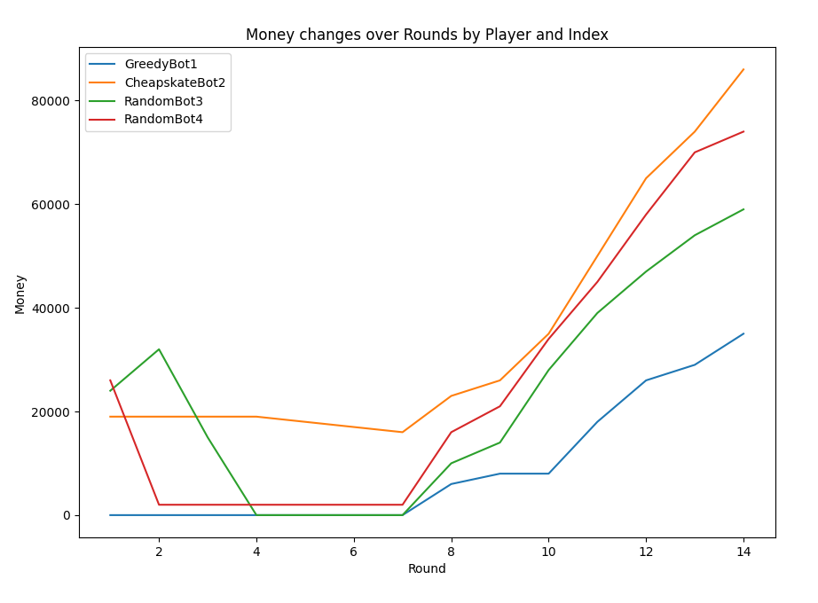

# For Sale Game Simulator

## Overview
This project is a simulation of the board game "For Sale". It includes several AI players with different strategies that can play against each other. The game consists of two phases: the buying phase, where players bid on properties, and the selling phase, where players sell their properties for the highest possible price.

## AI Players
### Implemented
#### RandomBot: 
  This player randomly selects a bid in the buying phase and a property to sell in the selling phase. 
  
*What are the rules, what am i even doing here? i guess i bet this much?*

#### GreedyBot
This player always tries to buy the cheapest available property and sell the least 
valuable property.  

*I WANT EVERYTHING AND STOP AT NOTHING.... WARNING. two of these faceing off gets hilarious.*

### Planned/in progress
- BraveCheapskateBot: This player will buy until outbid, but only the minimum. Brave guy never gives up though
- OptimalBot: This player uses a strategy that is designed to maximize its final score, based on certain assumptions about the other players' behavior.

## Getting Started

## Files in This Repository
RunGame.py: This is the main file to run the game.
forsale.py: This contains the Game class, which handles the game logic. TODO split out the players

## Built With
Python

## Contributing
Pull requests are welcome. For major changes, please open an issue first to discuss what you would like to change.

## License
This project is licensed under the MIT License - see the LICENSE.md file for details

## Acknowledgements
The creators of the "For Sale" board game for the game mechanics and rules
