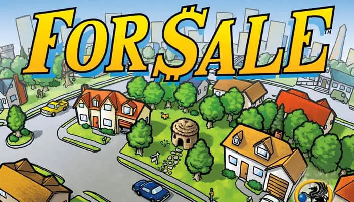

# For Sale Game Simulator

"For Sale" is a card game for 3-6 players involving bidding and bluffing. The game is divided into two phases - buying and selling.

During the buying phase, players bid on properties. When a player passes, they take the cheapest available property. The last player remaining takes the most expensive property.

In the selling phase, players sell their properties for currency. Players secretly choose a property to sell, with the highest property claiming the highest currency card.

The winner is the player with the most money at the end. The game strategy lies in deciding when to bid, pass, and sell.

  
  

## Overview

This project is a simulation of the board game "For Sale". It includes several AI players with different strategies that can play against each other. The game consists of two phases: the buying phase, where players bid on properties, and the selling phase, where players sell their properties for the highest possible price.

# Results
### Weighted Mean

After simulating 100,000 games, with random numbers 4-6 players of random bot types. The following results were shown.

 

#### Some Interesting insights
 - Most suprising to me was the incredibly low performance of the 'Historian bot'.  A bot that contained a huge amount of historical data and made decisions based on previous results.  Even under performing purely random bids by Randombot.  I theorise that this is a result of a mistake in the bot design, which encouraged hesitance in the auction round.  Resulting in the lowest property values overall for the strategies, making it unable to make money in the second round (Clearly the most significant round)
 - It is clear that a strategy of being frugal in the first round is most important overall, the weighted decision making of smart/prudent vs simply trying to get something for cheap seemed to be the happy medium.
 - This is a good analsyis that more 'advanced' methods are not always better.  And shows the importance of simulation and analysis to understand. 

### Scored Breakdown

The below table, indicates a winner but a close . Additionally the top three (Cheapskate, Prudent and Smart) indicate a higher performance especially when paired against other similar bots.

|Player|Weighted Mean|
|--|--|
|GreedyBot|        18070|
|RandomBot |       18500|
|HistorianBot|     22800|
|AnalystBot   |    25150|
|AuctioneerBot |   26200|
|BigSpenderBot  |  28250|
|CheapskateBot   | 29330|
|PrudentBot       |31040|
|SmartBot         |32860|

# Final Scores

 

# AI Players

## **RandomBot**: 
  I randomly select a bid in the buying phase and a property to sell in the selling phase. Chaos shall rule  
  
    *What are the rules, what am i even doing here? i guess i bet this much?*

## **GreedyBot**
I always try to buy the cheapest available property and sell the least. And I stop at nothing to win.
valuable property.  

    *What do you mean i have run out of money?!?*

## **CheapskateBot**

I will min bid as long as the bid is 25% of remaining money or 2000, whichever is greater 

    *I wanna play, but i dont want to spend money....*

## **PrudentBot**

During the bidding phase, I assess the quality of the properties available. 

If high-quality properties (above a certain threshold) are available, I'm willing to bid up to 60% of my remaining money. For properties below this threshold, I only bid up to 40% of my remaining money. 

    *Patience is a virtue, and I'm extremely virtuous*

## **SmartBot**

During the bidding phase, I bid up to 50% of its remaining money if I can afford the next highest bid.
In the buying phase, I buy the property closest to the median of the available properties I can afford.
In the selling phase, I sell the property closest to the median of my owned properties.  

    *Intelligence is the ability to adapt to change... and I'm always changing my bids!*

## **AuctioneerBot**

During the bidding phase, I take into consideration the probability of getting a high-quality property (above a certain threshold currently 15) 
based on the remaining properties. If the probability is high, I bid up to 70% of my remaining money. If the probability is low, I only bid up to 30% of my remaining money. 

    *Going once, going twice, SOLD to that cluster of Ram over there*

## **AnalystBot**

I consider both the current game state (the properties available for auction and their values) and the potential future state (the possible property or check cards that might come into play). I then adjust my bidding strategy according to my opponents' probable actions and remaining assets.  

    *HOLD ON HOLD ON, I'm still running the numbers*

## **HistorianBot**

I calculate the average successful bid for each round of the game from the historical data, then I use this information to make my own bids. I attempt to bid slightly higher than the current highest bid if the highest bid is less than the average successful bid for the current round.

*HistorianBot: 

    *Why hey there youn' un Did I tell you about that game back in '22? oooooh boy its a doozy, back in my day we bought houses for the right price. Let me show you how.*

# Further Considerations

At first glance, it would appear that the 'SmartBot' is the most effective bot. however, there are a number of other features that should be considered.

- Performance of playtimes has **some** difference vs number of players ie. the cheapskate strategy outperforms with lower players.  But generally the strategies seem to balance regardless of player numbers

- It is interesting to see the performance of players over rounds, of particular note is the final property value collected at the end of the first auction round.  This value was the largest indictator of the winner before the second round had even started.

### Performance over time

## How does the bot perform when there are other bots the same?

- Bots relying on historical, or particularly strict rules (cheapskate, historian and greed) often have a greater effect in games where others are implementing a similar strategy.  This is likely down to the lack of other players ability to exploit and benefit from their rigid strategy.  Most other 'high performing' bots are mostly uneffected by the number of players.

# Further work

To continue this project further i would be most interested in implementing a bot that has a tensorflow trained model to play this game.  I have implemented a framework called mlbot that could achieve this.

# Files in This Repository
RunGame.ipynb: This is the main file to run the game.
forsale.ipynb: This contains the Game class, which handles the game logic. TODO split out the players
plots.ipynb: This contains the various plots contained within this summary

## Built With
Python

## Contributing
Pull requests are welcome. For major changes, please open an issue first to discuss what you would like to change.

## License
This project is licensed under the MIT License - see the LICENSE.md file for details

## Acknowledgements
The creators of the "For Sale" board game for the game mechanics and rules
